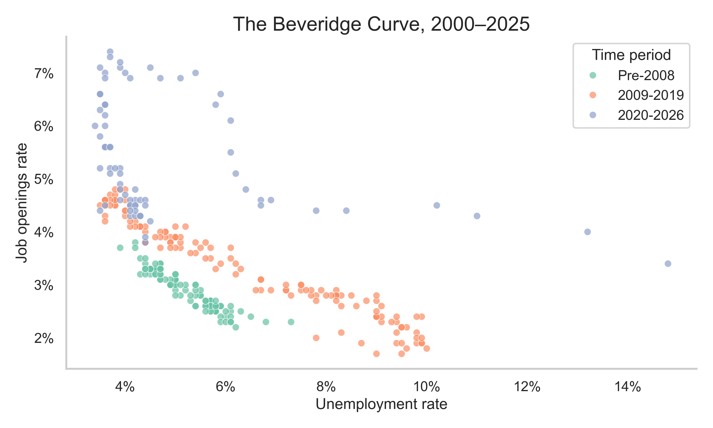

# Beveridge Curve Analysis
## Background
The Beveridge Curve is a graphical representation of the relationship between unemployment and job vacancies. The curve typically slopes downward, indicating the intuitive fact that as unemployment increases, the number of job vacancies tends to decrease, and vice versa. 

The position on the curve can tell us where we are in the business cycle. For example, during a recession, we would expect to see higher unemployment and fewer job vacancies, placing us on the lower right part of the curve. Conversely, during an economic expansion, we would expect to see lower unemployment and more job vacancies, placing us on the upper left part of the curve.

Shifts in the curve itself (as opposed to movements *along* the curve) can indicate changes in the efficiency of the labor market. That is, if there is a shift outward (to the right), it might tell us that for a given level of unemployment, there are more job vacancies than before. So, the labor market has become less efficient at matching workers to jobs. We have seen this in the aftermath of the 2008 financial crisis, and more recently, in the aftermath of the COVID-19 pandemic. 

In this notebook, I plot the Beveridge curve over time and compare clusters of points across periods (pre-2008, post-2008, post-2020) to visualize potential regime shifts.

## Specifications
### Data
The data for this analysis comes from the St. Louis Federal Reserve's [FRED](https://fred.stlouisfed.org/) database. We will be using the following series:
- Unemployment Rate [(UNRATE)](https://fred.stlouisfed.org/series/UNRATE)
- Job Openings: Total Nonfarm [(JTSJOR)](https://fred.stlouisfed.org/series/JTSJOR)

### How to Run
Create a virtual environment (recommended), install dependencies, then run the notebook:

`pip install -r requirements.txt`
`jupyter notebook main.ipynb`

### Repo Structure
- `main.ipynb`: The main Jupyter notebook containing the analysis and visualizations.
- `requirements.txt`: A list of Python packages required to run the notebook.
- `img/`: A directory containing the generated chart from the analysis.
- `raw_data/`: A directory containing the raw data files downloaded from FRED.

## Findings

The plotted points suggest an outward shift in the Beveridge curve in the period after the 2008 financial crisis and again after 2020, relative to the pre-2008 cloud of observations. This pattern is consistent with a change in the vacancy–unemployment relationship (often discussed as changes in matching efficiency), though this notebook is descriptive rather than causal.